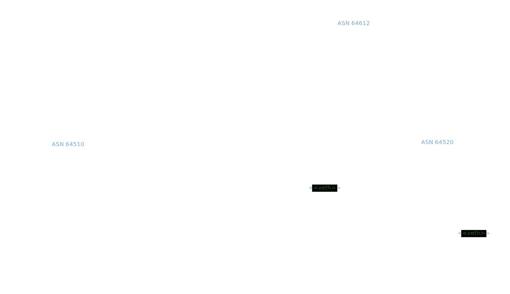

<!--
generated-by: bash <(curl -s -L https://github.com/TekWizely/bash-tpl/raw/refs/heads/main/bash-tpl) README.md.tpl | bash > README.md
-->

# FRR + Grout


This example shows the integration of FRRouting with Grout dataplane ([grout-frr.7.md](https://github.com/DPDK/grout/blob/main/docs/grout-frr.7.md)),
using the following network topology:



## Requirements

- [Docker](https://www.docker.com/)
- [CONTAINERlab](https://containerlab.dev/) CLI

## Setup

```sh
$ clab deploy
```

## Verify

HostA can ping HostB

```sh
$ docker exec clab-grout_frr-host_a ping -c 3 192.168.4.2
PING 192.168.4.2 (192.168.4.2) 56(84) bytes of data.
64 bytes from 192.168.4.2: icmp_seq=1 ttl=61 time=0.302 ms
64 bytes from 192.168.4.2: icmp_seq=2 ttl=61 time=0.384 ms
64 bytes from 192.168.4.2: icmp_seq=3 ttl=61 time=0.460 ms

--- 192.168.4.2 ping statistics ---
3 packets transmitted, 3 received, 0% packet loss, time 2069ms
rtt min/avg/max/mdev = 0.302/0.382/0.460/0.064 ms
```

## Inspect

BGP sessions correctly exchanged routes in spine's FRR
```sh
$ docker exec clab-grout_frr-spine vtysh -c "show ip route"
Codes: K - kernel route, C - connected, L - local, S - static,
       R - RIP, O - OSPF, I - IS-IS, B - BGP, E - EIGRP, N - NHRP,
       T - Table, A - Babel, F - PBR, f - OpenFabric,
       t - Table-Direct,
       > - selected route, * - FIB route, q - queued, r - rejected, b - backup
       t - trapped, o - offload failure

IPv4 unicast VRF default:
C>* 192.168.1.0/24 is directly connected, p0, weight 1, 00:09:21
L>* 192.168.1.1/32 is directly connected, p0, weight 1, 00:09:21
C>* 192.168.2.0/24 is directly connected, p1, weight 1, 00:09:21
L>* 192.168.2.1/32 is directly connected, p1, weight 1, 00:09:21
B>* 192.168.3.0/24 [20/0] via 192.168.1.2, p0, weight 1, 00:09:19
B>* 192.168.4.0/24 [20/0] via 192.168.2.2, p1, weight 1, 00:09:19
```

Routes have been installed into Grout

```sh
$ docker exec clab-grout_frr-spine-grout grcli --socket /shared/spine.grout.sock route show
VRF  DESTINATION     NEXT_HOP
0    192.168.1.0/24  type=L3 iface=p0 vrf=0 origin=INTERNAL af=IPv4 addr=192.168.1.1/24 mac=aa:c1:ab:3e:6d:88 static local link
0    192.168.2.0/24  type=L3 iface=p1 vrf=0 origin=INTERNAL af=IPv4 addr=192.168.2.1/24 mac=aa:c1:ab:d3:1a:7f static local link
0    192.168.3.0/24  type=L3 id=12 iface=p0 vrf=0 origin=zebra af=IPv4 addr=192.168.1.2 state=reachable mac=aa:c1:ab:42:15:44
0    192.168.4.0/24  type=L3 id=11 iface=p1 vrf=0 origin=zebra af=IPv4 addr=192.168.2.2 state=reachable mac=aa:c1:ab:8f:26:ac
0    fe80:101::/64   type=L3 iface=p0 vrf=0 origin=INTERNAL af=IPv6 addr=fe80::aac1:abff:fe3e:6d88/64 mac=aa:c1:ab:3e:6d:88 static local link
0    fe80:102::/64   type=L3 iface=p1 vrf=0 origin=INTERNAL af=IPv6 addr=fe80::aac1:abff:fed3:1a7f/64 mac=aa:c1:ab:d3:1a:7f static local link
```


## Details


Spine router BGP status
```
%v 'docker exec clab-grout_frr-spine vtysh -c "show bgp summary" | head'

%v 'docker exec clab-grout_frr-spine vtysh -c "show bgp ipv4" | head'
```

## Issue

### TTL exceeded 

By default, BGP messages generated by FRR have TTL=1. Without the FRR configuration

```
// spine.frr.conf
...
 neighbor 192.168.1.2 ebgp-multihop
...
  neighbor 192.168.2.2 ebgp-multihop
```

BGP packet are dropped by Grout routing:

```
$ docker logs -t clab-grout_frr-spine-grout  
...
2025-10-21T07:58:19.014342917Z NOTICE: GROUT: trace_log_packet: [rx gr-loop0] aa:f9:df:d8:10:5d > aa:f9:df:d8:10:5d / IP 192.168.2.1 > 192.168.2.2 ttl=1 proto=TCP(6) / TCP 37283 > 179 flags=S, (pkt_len=74)
2025-10-21T07:58:19.014376969Z NOTICE: GROUT: trace_log_packet: [rx gr-loop0] aa:f9:df:d8:10:5d > aa:f9:df:d8:10:5d / IP 192.168.1.1 > 192.168.1.2 ttl=1 proto=TCP(6) / TCP 39569 > 179 flags=S, (pkt_len=74)
2025-10-21T07:58:19.014740622Z NOTICE: GROUT: trace_log_packet: [tx p1] aa:c1:ab:8f:04:eb > aa:c1:ab:8f:04:eb / IP 192.168.2.1 > 192.168.2.1 ttl=64 proto=ICMP(1) / ICMP ttl exceeded in transit, (pkt_len=102)
2025-10-21T07:58:19.014746447Z NOTICE: GROUT: trace_log_packet: [tx p0] aa:c1:ab:ef:7f:60 > aa:c1:ab:ef:7f:60 / IP 192.168.1.1 > 192.168.1.1 ttl=64 proto=ICMP(1) / ICMP ttl exceeded in transit, (pkt_len=102)
```

and BGP sessions are not enstabilished:
```
$ docker exec clab-grout_frr-spine vtysh -c "show bgp neighbor" | grep state

  BGP state = Connect
  BGP state = Connect
```

### Interface protocol down

Grout port must be marked as `no link-detect` in zebra configuration:

```
interface p0
 no link-detect
exit

interface p1
 no link-detect
exit
```

otherwise, interfaces are marked as `line protocol down`

```
docker exec clab-grout_frr-spine vtysh -c "show interface" | grep -A3 " p0 "

Interface p0 is up, line protocol is down
  Link ups:       0    last: (never)
  Link downs:     0    last: (never)
  vrf: default
```

BGP sessions evetually become enstabilished:

```
$  docker exec clab-grout_frr-spine vtysh -c "show bgp neighbor" | grep state 

  BGP state = Established, up for 00:02:53
  BGP state = Established, up for 00:02:53
```

routes are correctly exchanged in FRR:

```
docker exec clab-grout_frr-spine vtysh -c "show bgp ipv4"    
BGP table version is 0, local router ID is 192.168.1.1, vrf id 0
Default local pref 100, local AS 64612
Status codes:  s suppressed, d damped, h history, u unsorted, * valid, > best, = multipath,
               i internal, r RIB-failure, S Stale, R Removed
Nexthop codes: @NNN nexthop's vrf id, < announce-nh-self
Origin codes:  i - IGP, e - EGP, ? - incomplete
RPKI validation codes: V valid, I invalid, N Not found

     Network          Next Hop            Metric LocPrf Weight Path
     192.168.3.0/24   192.168.1.2              0             0 64510 i
     192.168.4.0/24   192.168.2.2              0             0 64520 i

Displayed 2 routes and 2 total paths
```

but they are not injected into Grout:
```
docker exec -it clab-grout_frr-spine-grout grcli --socket /shared/spine.grout.sock route show

VRF  DESTINATION     NEXT_HOP
0    192.168.1.0/24  type=L3 iface=p0 vrf=0 origin=INTERNAL af=IPv4 addr=192.168.1.1/24 mac=aa:c1:ab:0b:5c:02 static local link
0    192.168.2.0/24  type=L3 iface=p1 vrf=0 origin=INTERNAL af=IPv4 addr=192.168.2.1/24 mac=aa:c1:ab:0f:eb:b4 static local link
0    fe80:101::/64   type=L3 iface=p0 vrf=0 origin=INTERNAL af=IPv6 addr=fe80::aac1:abff:fe0b:5c02/64 mac=aa:c1:ab:0b:5c:02 static local link
0    fe80:102::/64   type=L3 iface=p1 vrf=0 origin=INTERNAL af=IPv6 addr=fe80::aac1:abff:fe0f:ebb4/64 mac=aa:c1:ab:0f:eb:b4 static local link

$  docker exec -it clab-grout_frr-spine cat /etc/frr/frr.log 
...
2025/10/21 08:06:40 BGP: [VWNP2-DNMFV] Found existing bnc 192.168.1.2/32(0)(VRF default) flags 0xa ifindex 0 #paths 0 peer 0x556ac7a46a40, resolved prefix UNK prefix
2025/10/21 08:06:40 BGP: [JF58X-TA5AZ] bgp_update_nexthop_reachability_check(192.168.1.2): NH unresolved for existing 192.168.3.0/24 pi 0x556ac7a5a3c0 flags 0x0
```


## Inspect commands

```sh
# Inspect node FRR status 
docker exec clab-grout_frr-spine vtysh -c "show bgp neighbor"
docker exec clab-grout_frr-spine vtysh -c "show bgp ipv4" 
docker exec clab-grout_frr-spine vtysh -c "show bgp summary"
docker exec clab-grout_frr-spine vtysh -c "show ip route"
docker exec clab-grout_frr-spine vtysh -c "show interface"
docker exec clab-grout_frr-spine vtysh -c "show running-config" 

# FRR logs
docker exec -it clab-grout_frr-spine cat /etc/frr/frr.log

# Grout logs
docker logs -t -f clab-grout_frr-spine-grout

# Grout network namespace inspection
docker exec clab-grout_frr-spine-net-configure ip route
docker exec clab-grout_frr-spine-net-configure ip addr

# Grout status
docker exec -it clab-grout_frr-spine-grout grcli --socket /shared/spine.grout.sock route show
docker exec -it clab-grout_frr-spine-grout grcli --socket /shared/spine.grout.sock nexthop
docker exec -it clab-grout_frr-spine-grout grcli --socket /shared/spine.grout.sock interface
```
